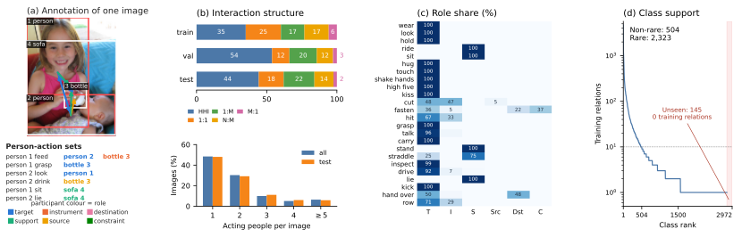
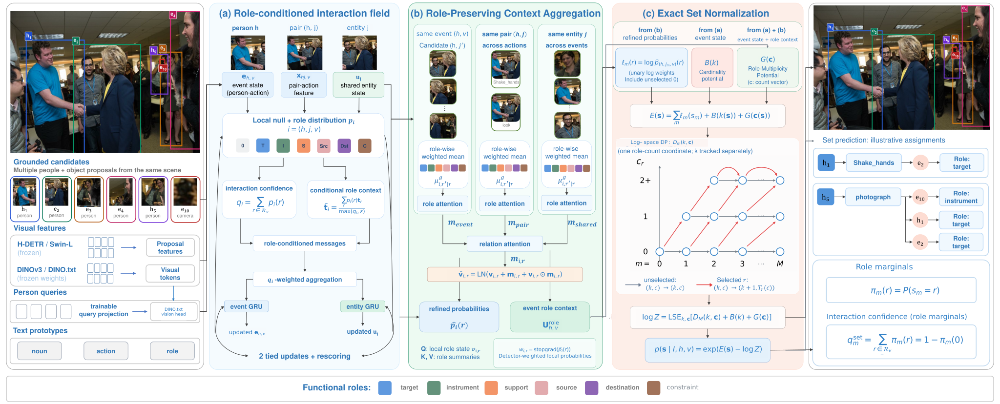

# HEIR: Learning Human-Entity Interactions with Functional Roles

<div align="center">

Di Wen<sup>1,*</sup>, Wenhao Guo<sup>1,*</sup>, Yuedong Tan<sup>2</sup>, Yun Huang<sup>1</sup>, Minheng Wu<sup>1</sup>, Zhihang Chen<sup>1</sup>,<br>
Haiwen Sun<sup>1</sup>, Fei Teng<sup>3</sup>, Zhiyuan Gao<sup>4</sup>, Yufeng Zhang<sup>1</sup>, Yuanhao Luo<sup>1</sup>, Jingqi Zhang<sup>1</sup>,<br>
Yufan Chen<sup>1</sup>, Junwei Zheng<sup>5</sup>, Ruiping Liu<sup>1</sup>, Jiale Wei<sup>1</sup>, Kailun Yang<sup>3</sup>, Kunyu Peng<sup>1,†</sup>

<p>
<sup>1</sup> Karlsruhe Institute of Technology (KIT)<br>
<sup>2</sup> Institute for Computer Science, Artificial Intelligence and Technology (INSAIT)<br>
<sup>3</sup> Hunan University<br>
<sup>4</sup> University of Bremen<br>
<sup>5</sup> ETH Zurich
</p>

<sup>*</sup> Equal contribution. &nbsp; <sup>†</sup> Corresponding author.

**A benchmark for complete human–entity interactions, and CoRISP for predicting participant–role sets.**

[Dataset](docs/DATASET.md) · [Benchmark](#heir-benchmark) · [Method](#corisp) · [Results](#paper-results) · [Quick start](#quick-start) · [Reproduction](docs/REPRODUCTION.md) · [Citation](#citation)

</div>

## HEIR benchmark

**Data:** [Hugging Face](https://huggingface.co/datasets/KratosWen/HEIR) · [Download instructions](docs/DATASET.md)

Who participates in an action, and what function does each participant serve? **HEIR** represents a person–action event as a complete set of participants and their functional roles. It supports multiple participants with the same role and entities shared across events.

| Images | Actions | Nouns | Functional roles | Train / validation / test |
| ---: | ---: | ---: | ---: | --- |
| 18,730 | 105 | 437 | 6 | 15,158 / 615 / 2,957 |

The six roles are **target, instrument, support, source, destination, and constraint**. Relation metrics evaluate individual interactions; Set mAP measures complete event recovery, requiring all participants and roles without extra members.



*Paper figure: shared participants across events, interaction and actor counts, role shares for the 24 most frequent actions, and training support of observed classes.*

## CoRISP

**Compositional Role-aware Interaction Set Prediction (CoRISP)** learns a normalized distribution over complete participant–role assignments. The implementation supports HEIR and V-COCO.



1. **Role-conditioned recurrent updates** collect visual evidence for candidate interactions.
2. **Role-preserving context aggregation** connects event, pair and shared-entity neighborhoods.
3. **Exact set normalization** combines interaction evidence with cardinality and role-multiplicity potentials. Relation marginals score individual interactions; joint probabilities score complete assignments.

The paper configuration uses frozen H-DETR/Swin-L proposals, a frozen DINOv3 ViT-L/16 backbone and a frozen DINO.txt vision head, with **9.9M trainable parameters**. Normalization is exact within each event's retained candidates and admissible support. See [Method](docs/METHOD.md) for the correspondence between the paper and implementation.

## Paper results

The following numbers are reported in the manuscript; all AP/mAP values are percentages.

### HEIR

| Method | HOI mAP | Role mAP | Set: Full | Single | Multi | Repeat | Shared |
| --- | ---: | ---: | ---: | ---: | ---: | ---: | ---: |
| CoRISP | 21.21 | 20.41 | 18.04 | 20.57 | 8.94 | 8.99 | 23.80 |

Single/Multi denote one-member/multi-member events; Repeat denotes repeated roles; Shared denotes shared-entity images. CoRISP leads the evaluated baselines on Repeat and Shared. RLIPv2 Swin-L leads on overall Set mAP (22.21), and SOV-STG Swin-L leads on Multi (9.87).

### V-COCO

| Scenario | Role AP | Set mAP: All | Set mAP: Dual |
| --- | ---: | ---: | ---: |
| S1 | 73.72 | 67.11 | 61.06 |
| S2 | 76.23 | 72.20 | 68.59 |

Role AP excludes `point`. Complete-set evaluation uses native role slots; Dual averages the two-slot actions `hit`, `eat` and `cut`. Role AP and Set mAP are distinct metrics. Published results under other evaluation conventions should not be ranked directly against this table.

## What is included

This is a source-code release. HEIR data is hosted separately on [Hugging Face](https://huggingface.co/datasets/KratosWen/HEIR); see [download instructions](docs/DATASET.md). Dataset annotations, images, semantic prototypes, support tables and pretrained or trained weights are not included. The synthetic example and numerical tests run without these assets or a GPU.

| Component | Entry point |
| --- | --- |
| Exact event normalization and set decoding | `evaluation/native.py` |
| HEIR training and prediction | `corisp_heir/train.py`, `corisp_heir/predict.py` |
| HEIR complete-set evaluation | `evaluation/heir_sets.py` |
| V-COCO training, caching and evaluation | `scripts/run_vcoco.sh` |
| Frozen visual encoders and detector integration | `integrations/` |

## Quick start

Run commands from the repository root. For the CPU example and test suite, use Python 3.11:

```bash
python3.11 -m venv .venv
source .venv/bin/activate
python -m pip install torch==2.5.1 torchvision==0.20.1 --index-url https://download.pytorch.org/whl/cpu
python -m pip install -r requirements-test.txt
export OMP_NUM_THREADS=1 MKL_NUM_THREADS=1 OPENBLAS_NUM_THREADS=1 NUMEXPR_NUM_THREADS=1
python -m examples.event_sets
python scripts/fetch_vendor.py
python -m pytest -q
python scripts/check_release.py
```

The full test suite also requires the pinned third-party source downloaded by `scripts/fetch_vendor.py`; this does not download model weights.

The example constructs a two-participant event, decodes synthetic potentials, and scores complete and incomplete predictions. It writes no files and downloads no assets. Its expected Set mAP is **100.0%** for the exact set and **0.0%** after a required participant is removed. These are interface checks, not benchmark results.

For training or image inference, follow [GPU installation](docs/INSTALLATION.md), provide the inputs in [Assets](docs/ASSETS.md), then use the [training and evaluation commands](docs/REPRODUCTION.md).

## Prediction and evaluation

HEIR set prediction retains up to eight count-state winners per person--action event and 100 sets per image, ranked by their normalized set probabilities. Role and HOI scores use relation marginals from the same model; HOI projection takes the maximum over roles. Select a checkpoint by validation Role mAP and use it consistently for test metrics and visualizations.

V-COCO uses native role slots and evaluates complete slot assignments under Scenarios 1 and 2. Official role AP and complete-set AP have separate evaluation entry points. [Method](docs/METHOD.md) and [Input Formats](docs/DATA_FORMATS.md) describe the model interfaces and score definitions.

## Documentation

| Guide | Contents |
| --- | --- |
| [Installation](docs/INSTALLATION.md) | CPU tests, CUDA setup and extension build |
| [Dataset](docs/DATASET.md) | HEIR release, download and checksum verification |
| [Assets](docs/ASSETS.md) | Required local files and configuration |
| [Training and Evaluation](docs/REPRODUCTION.md) | HEIR and V-COCO commands |
| [Method](docs/METHOD.md) | Paper-to-code correspondence |
| [Input Formats](docs/DATA_FORMATS.md) | Entity identities, annotations and prediction records |
| [Troubleshooting](docs/TROUBLESHOOTING.md) | Dependency, asset and evaluation errors |
| [Third-party Source](THIRD_PARTY.md) | Dependency origins and licenses |

The core model is in `src/corisp/`; dataset integration uses the `corisp_heir` namespace. Run the source checkout from its root. The repository is not distributed as a standalone pip package.

## Repository branches

| Branch | Contents |
| --- | --- |
| `main` | CoRISP source, training and evaluation interfaces, documentation and tests |
| [`reproductions/heir-baselines`](https://github.com/Kratos-Wen/HEIR/tree/reproductions/heir-baselines) | HEIR baseline evaluation tools and reproduction documentation |
| [`reproductions/vcoco-baselines`](https://github.com/Kratos-Wen/HEIR/tree/reproductions/vcoco-baselines) | V-COCO baseline implementations, adapters and evaluation tools |

Each reproduction branch has its own README describing its scope, required assets and evaluation commands. Baseline reproductions are separate from the CoRISP implementation on `main`.

## Citation

If HEIR or CoRISP supports your research, please cite the paper. Download [BibTeX](CITATION.bib), or use GitHub’s **Cite this repository** entry powered by [CITATION.cff](CITATION.cff).

```bibtex
@unpublished{wen2026heir,
  title = {{HEIR: Learning Human-Entity Interactions with Functional Roles}},
  author = {Di Wen and Wenhao Guo and Yuedong Tan and Yun Huang and
            Minheng Wu and Zhihang Chen and Haiwen Sun and Fei Teng and
            Zhiyuan Gao and Yufeng Zhang and Yuanhao Luo and Jingqi Zhang and
            Yufan Chen and Junwei Zheng and Ruiping Liu and Jiale Wei and
            Kailun Yang and Kunyu Peng},
  year = {2026},
  note = {Manuscript},
  url = {https://github.com/Kratos-Wen/HEIR}
}
```

## License

Original CoRISP contributions are available under the [PolyForm Noncommercial License 1.0.0](LICENSE). This is a **noncommercial source-available release**. Third-party code retains its own license, including Meta's separate DINOv3 agreement. See [NOTICE](NOTICE) and [THIRD_PARTY.md](THIRD_PARTY.md) for scope and attribution.
